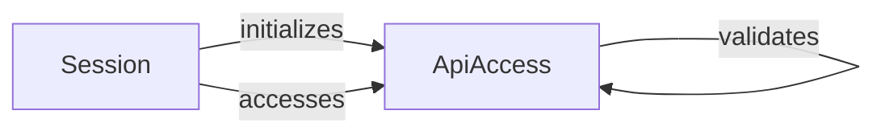

## Component Details

The Shopify API Access Control subsystem is responsible for managing and validating the scopes required for accessing Shopify resources. It ensures that the application has the necessary permissions to perform specific actions. The `Session` component manages the authentication and authorization state, while the `ApiAccess` component handles the validation of API access scopes. The flow starts with the creation of a `Session`, during which the `ApiAccess` component is initialized and the scopes are validated. This ensures that only authorized requests are allowed to access the Shopify API.

### Session
The `Session` class is responsible for managing the authentication and authorization state for a Shopify shop. It stores information such as the shop's domain, access token, and API version. It handles the retrieval and storage of access tokens, which are essential for making authorized requests to the Shopify API. The session is initialized with the shop domain and access token, and it provides methods for accessing and managing this information.
- **Related Classes/Methods**: `shopify_python_api.shopify.session.Session`

### ApiAccess
The `ApiAccess` class is responsible for managing and validating the access scopes required for interacting with the Shopify API. It stores the available and granted scopes and provides methods for validating if the granted scopes are sufficient for a particular API call. It acts as a gatekeeper, ensuring that only authorized requests are allowed to access the Shopify API. The `ApiAccess` component is initialized during the session creation and validates the scopes against the granted scopes.
- **Related Classes/Methods**: `shopify_python_api.shopify.api_access.ApiAccess`, `shopify_python_api.shopify.api_access.ApiAccess.__init__`, `shopify_python_api.shopify.api_access.ApiAccess.__store_scopes`, `shopify_python_api.shopify.api_access.ApiAccess.__validate_scopes`
