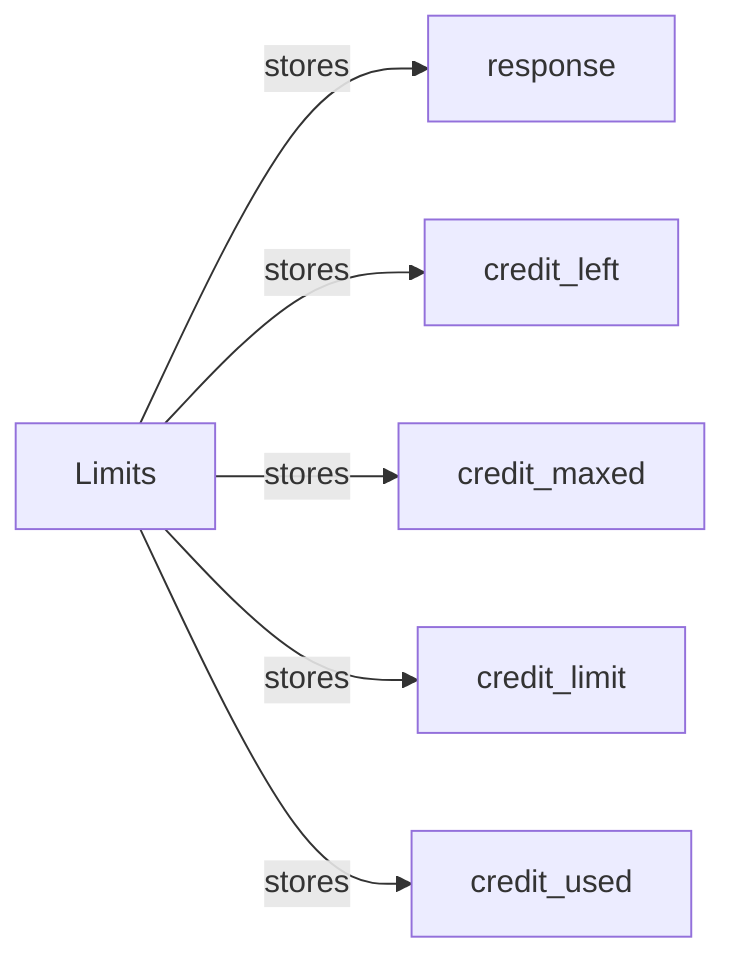

## Component Details

The API Rate Limiting component in the Shopify API Python library provides a mechanism to track and manage API usage, preventing applications from exceeding rate limits imposed by Shopify. The core of this component is the `Limits` class, which parses rate limit information from HTTP response headers and stores the credit usage. This allows developers to check the remaining API credits, determine if the limit has been reached, and adjust their application's behavior accordingly to avoid throttling. The component relies on the HTTP response from Shopify's API to extract rate limit data.

### Limits
The `Limits` class is responsible for storing and updating API rate limit information extracted from Shopify API responses. It parses the HTTP response headers to obtain the credit limit, credits used, and credits remaining. It provides methods to access and check these values, allowing developers to monitor their API usage.
- **Related Classes/Methods**: `shopify_python_api.shopify.limits.Limits`

### response
The `response` attribute within the `Limits` class stores the raw HTTP response object received from the Shopify API. This response object contains the headers that hold the rate limit information, which are then parsed by the `Limits` class.
- **Related Classes/Methods**: `shopify_python_api.shopify.limits.Limits`

### credit_left
The `credit_left` attribute stores the number of API credits remaining. It is updated based on the information extracted from the HTTP response headers. This attribute allows developers to quickly check how many API calls they can make before reaching the limit.
- **Related Classes/Methods**: `shopify_python_api.shopify.limits.Limits`

### credit_maxed
The `credit_maxed` attribute is a boolean flag that indicates whether the API credit limit has been reached. It is determined by comparing the credits used with the credit limit. This flag allows developers to easily determine if they need to pause or adjust their API calls.
- **Related Classes/Methods**: `shopify_python_api.shopify.limits.Limits`

### credit_limit
The `credit_limit` attribute stores the maximum API credit limit allowed. This value is extracted from the HTTP response headers and represents the total number of API calls that can be made within a specific time period.
- **Related Classes/Methods**: `shopify_python_api.shopify.limits.Limits`

### credit_used
The `credit_used` attribute stores the number of API credits that have been used. This value is extracted from the HTTP response headers and represents the number of API calls that have been made.
- **Related Classes/Methods**: `shopify_python_api.shopify.limits.Limits`
