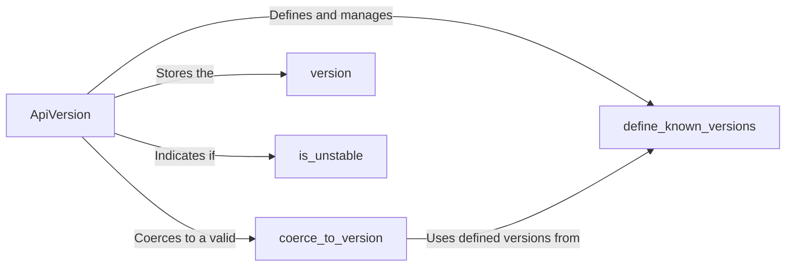

## Component Details

The API Versioning component provides a mechanism for specifying and validating the version of the Shopify API to be used. It defines known API versions, allows for coercion of version strings to ApiVersion objects, and provides a way to determine if a version is unstable. This ensures that the application interacts with the Shopify API in a compatible manner.

### ApiVersion
Represents a specific version of the Shopify API. It encapsulates the version string and provides methods for validation and comparison. It also determines if the version is unstable.
- **Related Classes/Methods**: `shopify_python_api.shopify.api_version.ApiVersion`

### coerce_to_version
A method within the ApiVersion class responsible for converting a version string into a valid ApiVersion object. It validates the input against the defined known versions and raises an exception if the version is invalid.
- **Related Classes/Methods**: `shopify_python_api.shopify.api_version.ApiVersion:coerce_to_version`

### define_known_versions
A method within the ApiVersion class that defines the valid and supported API versions. This method likely initializes a data structure containing the known versions, which is then used by `coerce_to_version` for validation.
- **Related Classes/Methods**: `shopify_python_api.shopify.api_version.ApiVersion:define_known_versions`

### version
A property of the ApiVersion class that stores the actual version string (e.g., '2023-01'). It's the core data representing the API version.
- **Related Classes/Methods**: `shopify_python_api.shopify.api_version.ApiVersion`

### is_unstable
A property of the ApiVersion class that indicates whether the API version is unstable or not.
- **Related Classes/Methods**: `shopify_python_api.shopify.api_version.ApiVersion`
