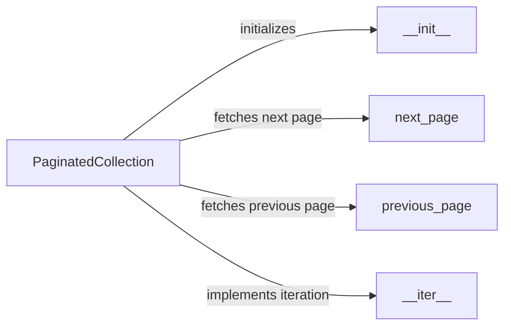

## Component Details

The `Collection Handling` component provides a mechanism for iterating over paginated collections of Shopify resources. It abstracts the complexity of fetching data from the Shopify API in chunks, allowing developers to easily retrieve large datasets. The core of this component is the `PaginatedCollection` class, which manages the pagination logic and provides methods for navigating through the pages of data. It simplifies the process of retrieving large datasets from the Shopify API by handling the fetching of next and previous pages of results.

### PaginatedCollection
The `PaginatedCollection` class is the central component for handling paginated data from the Shopify API. It stores the current URL, session, and response, and provides methods to navigate through the pages of data. It initializes with a URL and provides methods to navigate through the pages of data.
- **Related Classes/Methods**: `shopify_python_api.shopify.collection.PaginatedCollection`

### __init__
The `__init__` method is the constructor of the `PaginatedCollection` class. It initializes the collection with the initial URL, session, and response obtained from the Shopify API. It sets up the necessary attributes for managing the pagination process.
- **Related Classes/Methods**: `shopify_python_api.shopify.collection.PaginatedCollection.__init__`

### next_page
The `next_page` method fetches the next page of results from the Shopify API, if available. It constructs the next page URL based on the 'next' link in the response headers and makes a request to retrieve the data. It returns a new `PaginatedCollection` instance representing the next page.
- **Related Classes/Methods**: `shopify_python_api.shopify.collection.PaginatedCollection.next_page`

### previous_page
The `previous_page` method fetches the previous page of results from the Shopify API, if available. It constructs the previous page URL based on the 'previous' link in the response headers and makes a request to retrieve the data. It returns a new `PaginatedCollection` instance representing the previous page.
- **Related Classes/Methods**: `shopify_python_api.shopify.collection.PaginatedCollection.previous_page`

### __iter__
The `__iter__` method makes the `PaginatedCollection` iterable, allowing users to loop through the results page by page. It yields the items from the current page and automatically fetches the next page when the current page is exhausted, providing a seamless iteration experience.
- **Related Classes/Methods**: `shopify_python_api.shopify.collection.PaginatedCollection.__iter__`
