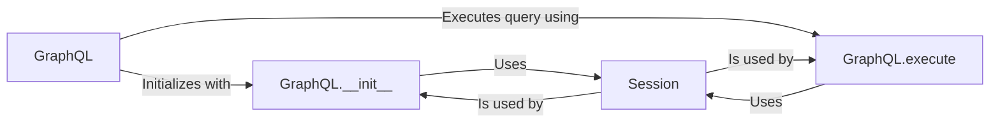

## Component Details

The GraphQL Client component provides a way to interact with the Shopify API using GraphQL queries. It encapsulates the logic for executing queries and handling responses, offering a more flexible alternative to the REST API. The client is initialized with a session, which manages authentication and request details. The execute method sends the GraphQL query to the Shopify API and returns the result.

### GraphQL
Represents the GraphQL client. It is responsible for initializing the client with a session and providing the execute method for running GraphQL queries against the Shopify API.
- **Related Classes/Methods**: `shopify_python_api.shopify.resources.graphql.GraphQL`

### GraphQL.__init__
Initializes the GraphQL client with a session object. The session is used for authentication and request management when interacting with the Shopify API.
- **Related Classes/Methods**: `shopify_python_api.shopify.resources.graphql.GraphQL.__init__`

### GraphQL.execute
Executes a GraphQL query against the Shopify API. It takes the query as input and uses the session to send the request and retrieve the response. It handles the communication with the Shopify API endpoint.
- **Related Classes/Methods**: `shopify_python_api.shopify.resources.graphql.GraphQL.execute`

### Session
Represents a session with the Shopify API. It handles authentication, request management, and other session-related tasks. It is used by the GraphQL client to make requests to the API.
- **Related Classes/Methods**: `shopify_python_api.shopify.session.Session`
