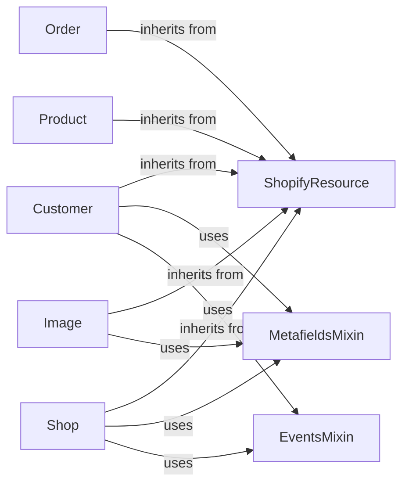

## Component Details

The Resource Management component in the Shopify API Python library provides a foundation for interacting with various Shopify resources like products, orders, and customers. It defines a base class, `ShopifyResource`, that handles common API operations such as creating, retrieving, updating, and deleting resources. Mixins like `MetafieldsMixin` and `EventsMixin` extend the functionality of resources by adding support for metafields and events, respectively. Concrete resource classes, such as `Customer`, `Order`, and `Product`, inherit from `ShopifyResource` and implement resource-specific logic. This system promotes code reuse and simplifies the process of interacting with the Shopify API.

### ShopifyResource
Base class for all Shopify resources, providing common API interaction methods. It defines the basic CRUD operations and attributes shared across all resources.
- **Related Classes/Methods**: `shopify_python_api.shopify.base.ShopifyResource`, `shopify_python_api.shopify.base.ShopifyResourceMeta`

### MetafieldsMixin
Mixin for managing metafields associated with a resource. It provides methods to retrieve, create, update, and delete metafields for a given resource.
- **Related Classes/Methods**: `shopify_python_api.shopify.mixins.Metafields`

### EventsMixin
Mixin for accessing events associated with a resource. It provides methods to retrieve events related to a specific resource.
- **Related Classes/Methods**: `shopify_python_api.shopify.mixins.Events`

### Customer
Represents a Shopify customer, extending ShopifyResource with customer-specific functionalities. It inherits the basic API operations from ShopifyResource and adds attributes and methods specific to customers.
- **Related Classes/Methods**: `shopify_python_api.shopify.resources.customer.Customer`

### Order
Represents a Shopify order, extending ShopifyResource with order-specific functionalities. It inherits the basic API operations from ShopifyResource and adds attributes and methods specific to orders.
- **Related Classes/Methods**: `shopify_python_api.shopify.resources.order.Order`

### Product
Represents a Shopify product, extending ShopifyResource with product-specific functionalities. It inherits the basic API operations from ShopifyResource and adds attributes and methods specific to products.
- **Related Classes/Methods**: `shopify_python_api.shopify.resources.product.Product`

### Image
Represents a Shopify Image, extending ShopifyResource. It inherits the basic API operations from ShopifyResource and adds attributes and methods specific to images.
- **Related Classes/Methods**: `shopify_python_api.shopify.resources.image.Image`

### Shop
Represents the Shopify shop, extending ShopifyResource. It inherits the basic API operations from ShopifyResource and adds attributes and methods specific to the shop.
- **Related Classes/Methods**: `shopify_python_api.shopify.resources.shop.Shop`
