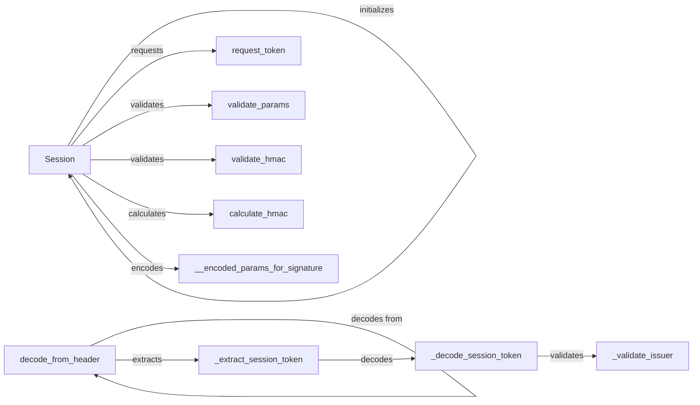

## Component Details

The Session Management component is responsible for handling the authentication and authorization of Shopify apps. It manages the creation, validation, and persistence of sessions, ensuring secure communication with the Shopify API. The core of this component revolves around the Session class, which encapsulates session data and provides methods for requesting access tokens, validating parameters, and calculating HMAC signatures. Session tokens are extracted, decoded, and validated to authenticate requests. This system ensures that only authorized requests are processed, maintaining the integrity and security of the application.

### Session
The Session class is the central component for managing Shopify sessions. It handles the creation, storage, and retrieval of session data, including the access token, shop domain, and other relevant information. It also provides methods for requesting access tokens from Shopify's OAuth server and validating the integrity of requests using HMAC signatures.
- **Related Classes/Methods**: `shopify_python_api.shopify.session.Session`

### request_token
The request_token method is responsible for initiating the OAuth flow and requesting an access token from Shopify. It constructs the authorization URL, redirects the user to Shopify for authentication, and exchanges the authorization code for an access token upon successful authentication.
- **Related Classes/Methods**: `shopify_python_api.shopify.session.Session:request_token`

### validate_params
The validate_params method validates the parameters received during the OAuth callback, ensuring that they are valid and have not been tampered with. It checks for the presence of required parameters, verifies the HMAC signature, and ensures that the shop domain is valid.
- **Related Classes/Methods**: `shopify_python_api.shopify.session.Session:validate_params`

### validate_hmac
The validate_hmac method validates the HMAC (Hash-based Message Authentication Code) to ensure the integrity and authenticity of the request, preventing tampering. It compares the calculated HMAC with the received HMAC to verify that the parameters have not been modified during transit.
- **Related Classes/Methods**: `shopify_python_api.shopify.session.Session:validate_hmac`

### calculate_hmac
The calculate_hmac method calculates the HMAC for a given set of parameters, used for verifying the authenticity of requests. It uses the application's shared secret to generate a unique hash of the parameters, which can then be compared with the received HMAC.
- **Related Classes/Methods**: `shopify_python_api.shopify.session.Session:calculate_hmac`

### __encoded_params_for_signature
The __encoded_params_for_signature method encodes the parameters in a specific format required for HMAC calculation. It sorts the parameters alphabetically, encodes them as UTF-8, and joins them with an ampersand (&) to create a string that can be used as input to the HMAC algorithm.
- **Related Classes/Methods**: `shopify_python_api.shopify.session.Session:__encoded_params_for_signature`

### decode_from_header
The decode_from_header method decodes the session token from the request header. It extracts the token from the header, decodes it using base64, and returns the decoded session token.
- **Related Classes/Methods**: `shopify_python_api.shopify.session_token:decode_from_header`

### _extract_session_token
The _extract_session_token method extracts the session token from the header. It searches for the session token in the header and returns it.
- **Related Classes/Methods**: `shopify_python_api.shopify.session_token:_extract_session_token`

### _decode_session_token
The _decode_session_token method decodes the session token. It decodes the token using base64 and returns the decoded session token.
- **Related Classes/Methods**: `shopify_python_api.shopify.session_token:_decode_session_token`

### _validate_issuer
The _validate_issuer method validates the issuer of the session token. It checks if the issuer is a valid Shopify domain.
- **Related Classes/Methods**: `shopify_python_api.shopify.session_token:_validate_issuer`
