```mermaid
graph LR
    Session_Management["Session Management"]
    API_Access_Control["API Access Control"]
    API_Versioning["API Versioning"]
    Resource_Management["Resource Management"]
    Collection_Handling["Collection Handling"]
    API_Rate_Limiting["API Rate Limiting"]
    GraphQL_Client["GraphQL Client"]
    Session_Management -- "manages" --> API_Access_Control
    Session_Management -- "uses" --> API_Versioning
    Resource_Management -- "uses" --> Session_Management
    Resource_Management -- "handles" --> Collection_Handling
    API_Rate_Limiting -- "provides" --> Resource_Management
    GraphQL_Client -- "uses" --> Session_Management
    Resource_Management -- "uses" --> API_Rate_Limiting
    API_Access_Control -- "authenticates" --> Resource_Management
    click Session_Management href "https://github.com/CodeBoarding/GeneratedOnBoardings/blob/main/shopify_python_api/Session Management.md" "Details"
    click API_Access_Control href "https://github.com/CodeBoarding/GeneratedOnBoardings/blob/main/shopify_python_api/API Access Control.md" "Details"
    click API_Versioning href "https://github.com/CodeBoarding/GeneratedOnBoardings/blob/main/shopify_python_api/API Versioning.md" "Details"
    click Resource_Management href "https://github.com/CodeBoarding/GeneratedOnBoardings/blob/main/shopify_python_api/Resource Management.md" "Details"
    click Collection_Handling href "https://github.com/CodeBoarding/GeneratedOnBoardings/blob/main/shopify_python_api/Collection Handling.md" "Details"
    click API_Rate_Limiting href "https://github.com/CodeBoarding/GeneratedOnBoardings/blob/main/shopify_python_api/API Rate Limiting.md" "Details"
    click GraphQL_Client href "https://github.com/CodeBoarding/GeneratedOnBoardings/blob/main/shopify_python_api/GraphQL Client.md" "Details"
```

## Component Details

The shopify_python_api library provides a comprehensive interface for interacting with the Shopify platform. It encapsulates functionalities for session management, API versioning, resource handling, and GraphQL querying. The library simplifies the development of Shopify applications by providing a structured and consistent way to access Shopify's APIs.

### Session Management
This component is responsible for managing Shopify sessions, including creation, validation, and persistence. It handles the OAuth flow for authenticating users and obtaining access tokens, and provides methods for validating HMAC signatures and ensuring the integrity of requests. It plays a central role in authenticating requests to the Shopify API.
- **Related Classes/Methods**: `shopify.session.Session`, `shopify.session_token.decode_from_header`, `shopify.session_token._extract_session_token`, `shopify.session_token._decode_session_token`, `shopify.session_token._validate_issuer`, `shopify.session_token._validate_issuer_hostname`, `shopify.session_token._validate_issuer_and_dest_match`

### API Access Control
This component manages API access scopes and validates them during session creation. It ensures that the application has the necessary permissions to access specific resources. It acts as a gatekeeper, ensuring that only authorized requests are allowed to access the Shopify API.
- **Related Classes/Methods**: `shopify.api_access.ApiAccess`, `shopify.api_access.ApiAccess.__init__`, `shopify.api_access.ApiAccess.__store_scopes`, `shopify.api_access.ApiAccess.__validate_scopes`

### API Versioning
This component handles API versioning, allowing developers to specify the version of the Shopify API they want to use. It provides methods for coercing versions and defining known versions. It ensures compatibility between the application and the Shopify API.
- **Related Classes/Methods**: `shopify.api_version.ApiVersion`, `shopify.api_version.ApiVersion.coerce_to_version`, `shopify.api_version.ApiVersion.define_known_versions`

### Resource Management
This component provides a base class for all Shopify resources, such as products, orders, and customers. It handles the creation, retrieval, updating, and deletion of resources via the Shopify API. It also includes mixins for handling metafields and events. It serves as the foundation for interacting with Shopify resources.
- **Related Classes/Methods**: `shopify.base.ShopifyResource`, `shopify.base.ShopifyResourceMeta`, `shopify.mixins.Metafields`, `shopify.mixins.Events`, `shopify.resources.customer.Customer`, `shopify.resources.article.Article`, `shopify.resources.image.Image`, `shopify.resources.product.Product`, `shopify.resources.inventory_level.InventoryLevel`, `shopify.resources.recurring_application_charge.RecurringApplicationCharge`, `shopify.resources.order.Order`, `shopify.resources.gift_card.GiftCard`, `shopify.resources.smart_collection.SmartCollection`, `shopify.resources.blog.Blog`, `shopify.resources.price_rule.PriceRule`, `shopify.resources.application_charge.ApplicationCharge`, `shopify.resources.refund.Refund`, `shopify.resources.custom_collection.CustomCollection`, `shopify.resources.draft_order.DraftOrder`, `shopify.resources.discount_code_creation.DiscountCodeCreation`, `shopify.resources.asset.Asset`, `shopify.resources.comment.Comment`, `shopify.resources.user.User`, `shopify.resources.location.Location`, `shopify.resources.shop.Shop`, `shopify.resources.fulfillment.Fulfillment`

### Collection Handling
This component provides a way to iterate over paginated collections of Shopify resources. It handles fetching the next and previous pages of results. It simplifies the process of retrieving large datasets from the Shopify API.
- **Related Classes/Methods**: `shopify.collection.PaginatedCollection`, `shopify.collection.PaginatedCollection.__init__`, `shopify.collection.PaginatedCollection.previous_page`, `shopify.collection.PaginatedCollection.next_page`, `shopify.collection.PaginatedCollection.__iter__`

### API Rate Limiting
This component provides access to the Shopify API rate limits. It allows developers to check the remaining API credits and determine if the limit has been reached. It helps prevent applications from exceeding the API rate limits and being throttled.
- **Related Classes/Methods**: `shopify.limits.Limits`, `shopify.limits.Limits.response`, `shopify.limits.Limits.api_credit_limit_param`, `shopify.limits.Limits.credit_left`, `shopify.limits.Limits.credit_maxed`, `shopify.limits.Limits.credit_limit`, `shopify.limits.Limits.credit_used`

### GraphQL Client
This component provides an interface for executing GraphQL queries against the Shopify API. It allows developers to retrieve specific data from the Shopify API using a flexible query language. It offers an alternative to the REST API for data retrieval.
- **Related Classes/Methods**: `shopify.resources.graphql.GraphQL`, `shopify.resources.graphql.GraphQL.__init__`, `shopify.resources.graphql.GraphQL.execute`